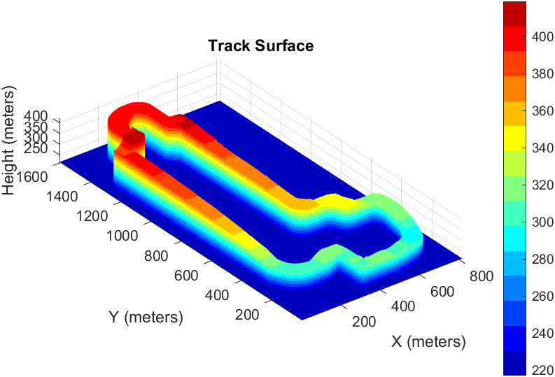

# Track Surface Visualization in MATLAB

## Overview
This README provides instructions on how to use MATLAB to import and visualize the track surface data generated by the Python script "Track Surface Analysis." The script processes track data to create a matrix representation of the track surface, saved as a CSV file. The MATLAB code is used to import this CSV file and create visualizations, including 3D surface plots and thermal plots, to illustrate height variations along the track.

## Data Format
The track surface data is expected to be in a CSV file, typically named `TrackSurface_Wider.csv`, generated by the Python script. Each value in the CSV file represents the height at a specific point on the track surface.

## MATLAB Visualization Features
- **Importing Data**: The MATLAB code imports the track surface data from the CSV file into a numeric matrix.
- **3D Surface Plot**: Creates a 3D surface plot of the track using the imported data.
- **Thermal Plot**: Generates a thermal plot of the track using latitude, longitude, and height data.
- **Customizable Visualization**: Users can adjust view angles, color maps, and other plot settings.

## Visualization Examples
### 3D Surface Plot


### Thermal Plot (`heatMap_track.mlx`)
The MATLAB script `heatMap_track.mlx` creates a thermal plot of the track, visualizing the elevation profile using latitude, longitude, and height data. 

Example Thermal Plot:


## Usage
To visualize the track surface in MATLAB:
1. Ensure that the `TrackSurface_Wider.csv` file is in your MATLAB workspace or provide the correct file path.
2. Use the provided MATLAB commands or script to import the data and create a 3D surface plot or thermal plot.


Example MATLAB commands:
```matlab
data = readmatrix('TrackSurface_Wider.csv');
surf(data);
xlabel('X (meters)');
ylabel('Y (meters)');
zlabel('Height (meters)');
title('Track Surface');
colorbar;
axis equal;
```

## Author
[Ines Alejandro Garcia Mosqueda]